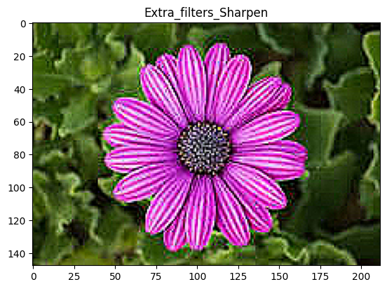
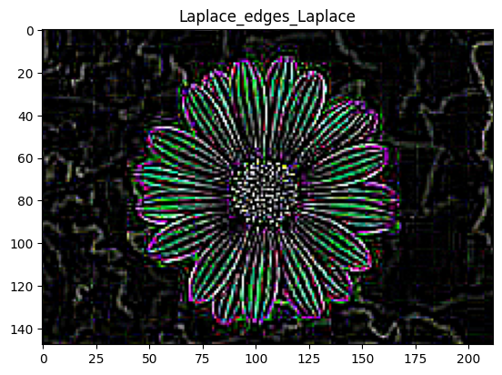
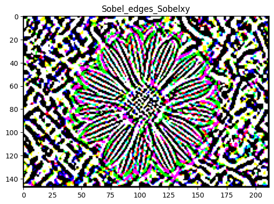
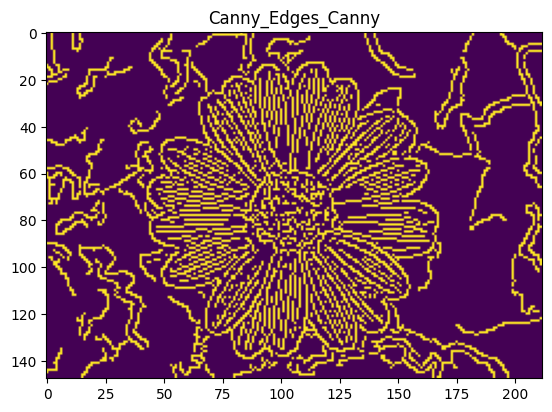

# image-edge-detection

## 🖼️ Image Edge Detection with Filtering using Python

This project implements multiple edge detection and image filtering techniques using Python libraries like OpenCV, NumPy, and Matplotlib. It takes a color image input and applies Laplace, Sobel, and Canny edge detectors, as well as sharpening and blurring filters.

---

## ✨ Features

- 📏 **Laplace Edge Detection**
- 🔄 **Sobel Edge Detection** (X, Y, XY)
- 🌀 **Canny Edge Detection**
- ✨ **Image Sharpening**
- 🌫️ **Gaussian Blur**
- 📊 **Visualization** of all filters with `matplotlib`

---

## 📂 File Overview

| File Name         | Description                                                                 |
|------------------|-----------------------------------------------------------------------------|
| `edge_filters.py` | Main Python script that loads an image, applies filters, and displays results |
| `Flower.jpg`      | Sample input image (you can replace this with your own image)               |
| `README.md`       | This documentation file                                                     |

---

## ▶️ How to Run

1. Make sure you have the required libraries:
   ```bash
   pip install numpy opencv-python matplotlib pillow
   ```

2. Save your image in the same folder as the script (e.g., `Flower.jpg`).

3. Run the script:
   ```bash
   python edge_filters.py
   ```

---

## 🧠 How It Works

- Loads an RGB image using PIL
- Converts the image to a NumPy array
- Applies custom convolution kernels and OpenCV filters
- Displays results using `matplotlib`

---
### 🖼️ Output  
---

#### 🔹 Extra Filter - Blur  
  
*Blur Filter Applied*

#### 🔹 Extra Filter - Sharpen  
  
*Sharpen Filter Applied*

#### 🔹 Laplace Edges - Laplace  
  
*Laplace Edge Detection*

#### 🔹 Sobel Edges - SobelXY  
  
*Sobel XY Edge Detection*

#### 🔹 Canny Edges - Canny  
  
*Canny Edge Detection*


